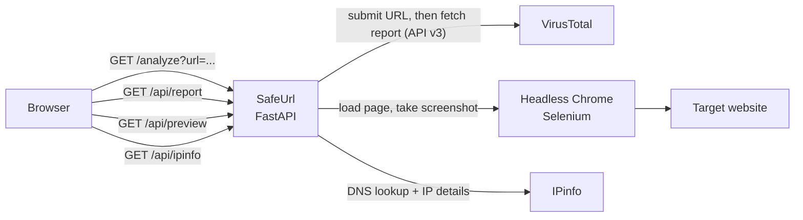

*Please :star: this repo if you find it useful*

<p align="left"><br>
<a href="https://www.paypal.com/paypalme/techblogil?locale.x=he_IL" target="_blank"></a>
</p>


# SafeUrl
## Safely check a URL before clicking it.

With the growing amount of spam, phishing, and malicious messages, I needed a tool that would help me safely check a URL before I clicked it.
There are other options, like VirusTotal, but I wanted something more, such as a preview of the final URL or IP information about the hosting service,
so I combined them all into one lightweight and simple application.

SafeUrl is a small, self-hosted [FastAPI](https://fastapi.tiangolo.com/) web application with an [AdminLTE](https://adminlte.io/) UI.
You enter a URL and SafeUrl:

- submits it to [VirusTotal](https://www.virustotal.com/gui/home/url) and shows the multi-engine verdict and the website details VirusTotal collected;
- opens it in a headless Chrome browser on the server and shows you a screenshot, so you never have to open the page yourself;
- resolves the host name and shows IP information from [IPinfo](https://ipinfo.io/).

## Table of contents

- [Features](#features)
- [How it works](#how-it-works)
- [Limitations](#limitations)
- [Requirements](#requirements)
- [Installation](#installation)
- [Configuration](#configuration)
- [Checking a URL](#checking-a-url)
- [API endpoints](#api-endpoints)
- [Troubleshooting](#troubleshooting)
- [Security notes](#security-notes)
- [Development](#development)
- [Contributing](#contributing)
- [License](#license)

## Features
With SafeUrl, you can get the following information:
* **Report summary** from [VirusTotal](https://www.virustotal.com/gui/home/url): the number of engines that rated the URL harmless, malicious, suspicious, undetected, or timed out.
* **Report info**: first submission date, last submission date, last analysis date, times submitted, and reputation.
* **Scan results**: the verdict of every VirusTotal engine (engine, category, method), with toggles to show or hide clean, malicious, suspicious, and unrated results.
* **Site preview**: a screenshot of the page, taken by headless Chrome on the server.
* **Website info**:
    * Final URL.
    * Redirection chain (if there are redirects).
    * Page title.
    * HTTP response headers.
    * Outgoing links.
    * HTML meta information.
    * Trackers (Google Tag Manager, Analytics, pixels, and more), as detected by VirusTotal.
    * IP information using [IPinfo](https://ipinfo.io/).
* **Prometheus metrics** at `/metrics` (via [starlette_exporter](https://github.com/stephenhillier/starlette_exporter)).
* **Several VirusTotal API keys** (comma-separated) to spread requests over more quota. This is in the code on `main` but not yet in a published Docker image; see [Installation](#installation).

## How it works



1. The home page sends you to `/analyze?url=<your URL>`.
2. The analyze page calls three API endpoints in the background:
   * `/api/report` submits the URL to the VirusTotal API v3 (`POST /api/v3/urls`), waits 5 seconds, then fetches the URL report (`GET /api/v3/urls/{id}`). The report fills the summary, report info, scan results, and website info.
   * `/api/preview` opens the URL in headless Chrome (1920×1080 window) and saves a screenshot of the page body in the `preview` folder. On `main` only, `http://` is added if the URL has no `http`/`https` scheme (the published `2.3.0` image doesn't do this). On failure, a default error image is shown.
   * `/api/ipinfo` is called with the final URL from the VirusTotal report. It resolves the host name to an IPv4 address and queries `https://ipinfo.io/<ip>/json`.

### Limitations
* The [VirusTotal](https://www.virustotal.com/gui/home/url) free (public) API is limited to 4 requests/minute. Each check uses 2 requests (submit + report). <!-- TODO: verify current VirusTotal public API quota -->
* The [IPinfo](https://ipinfo.io/) free plan was limited to 50,000 requests/month when this project was written. <!-- TODO: verify current IPinfo free plan limits -->
* The report is fetched 5 seconds after submission. For a URL VirusTotal has not seen before, the analysis may not be finished yet.
* Only IPv4 addresses are looked up.

## Requirements

* Docker (recommended). The image is based on [`techblog/selenium`](https://hub.docker.com/r/techblog/selenium), which provides Chrome and ChromeDriver. Published images are `linux/amd64` only.
* A **VirusTotal API key** (required).
* An **IPinfo access token** (optional).

### Getting a VirusTotal API key

1. Open [VirusTotal](https://www.virustotal.com/gui/home/url) and click **Sign up** to create a free account.

   [](https://raw.githubusercontent.com/t0mer/SafeUrl/main/Images/SafeUrl%20-%20VirusTotal%20SignUp.PNG?raw=true)

2. After signing in, open your user menu and select **API key**.
3. Copy your personal API key:

   [](https://raw.githubusercontent.com/t0mer/SafeUrl/main/Images/SafeUrl%20-%20VirusTotal%20API.PNG?raw=true)

4. Set it as the `VT_API_KEY` environment variable (see [Configuration](#configuration)).

### Getting an IPinfo token (optional)

1. Open [IPinfo](https://ipinfo.io/) and click **Sign up** to create a free account.

   [](https://raw.githubusercontent.com/t0mer/SafeUrl/main/Images/SafeUrl%20-%20Ipinfo%20account.PNG?raw=true)

2. After signing in, open the **Dashboard**.

   [](https://raw.githubusercontent.com/t0mer/SafeUrl/main/Images/SafeUrl%20-%20IpInfo%20go%20to%20dashboard.PNG?raw=true)

3. Open **Token** in the side menu and copy your access token.
4. Set it as the `IPINFO_API_KEY` environment variable.

## Installation

The Docker image is published to Docker Hub as [`techblog/safeurl`](https://hub.docker.com/r/techblog/safeurl).

> **Note:** the newest published image is `2.3.0` (also tagged `latest`, March 2022). It listens on port **8080** and accepts a single VirusTotal key.
> The code on `main` (version `2.3.1`, not yet released) listens on port **8081**, accepts several comma-separated VirusTotal keys, adds `http://` to preview URLs that have no scheme, and has a new home page design.
> If you build the image yourself from `main`, map port 8081 (see [Build the image from source](#build-the-image-from-source)).

### Docker Compose (from Docker Hub)
```yaml
services:
  safeurl:
    image: techblog/safeurl:latest
    container_name: safeurl
    restart: always
    ports:
      - "8080:8080"
    environment:
      - VT_API_KEY=[Your VirusTotal API Key] # Required
      - IPINFO_API_KEY=[Your IPinfo API Key] # Optional
```

```bash
docker compose up -d
```

Then open `http://<your-server>:8080`.

### Docker (from Docker Hub)
```bash
docker run -d --name safeurl --restart always \
  -p 8080:8080 \
  -e VT_API_KEY="<your VirusTotal API key>" \
  -e IPINFO_API_KEY="<your IPinfo token>" \
  techblog/safeurl:latest
```

### Build the image from source
```bash
git clone https://github.com/t0mer/SafeUrl.git
cd SafeUrl
docker build -t safeurl .
docker run -d --name safeurl -p 8080:8081 \
  -e VT_API_KEY="<key1>,<key2>" \
  -e IPINFO_API_KEY="<your IPinfo token>" \
  safeurl
```

<!-- TODO: verify that the current techblog/selenium:latest base image still provides numpy, /usr/bin/chromedriver, and a Selenium version with the legacy API (executable_path, find_element_by_tag_name) that app/ uses. -->

To run it without Docker, see [Development](#development).

## Configuration

SafeUrl is configured only through environment variables.

| Variable | Required | Default (Docker image) | Description |
|---|---|---|---|
| `VT_API_KEY` | Yes | `""` (empty) | VirusTotal API key. On `main` (not yet released) it can be a comma-separated list of keys; a random key is used for each VirusTotal request. When empty, the **Check URL** button is disabled. |
| `IPINFO_API_KEY` | No | `""` (empty) | IPinfo access token, sent as the `token` query parameter to `ipinfo.io`. |

Other settings are fixed in the code:

| Setting | Value |
|---|---|
| Listening address | `0.0.0.0` |
| Port | `8080` in the published `2.3.0` image, `8081` on `main` (`app/app.py`). The Dockerfile declares `EXPOSE 8080`. |
| Screenshot folder | `preview/` next to `app.py` (`/opt/app/preview` in the image) |
| ChromeDriver path | `/usr/bin/chromedriver` on `main` (`/opt/chromedriver/chromedriver` in `2.3.0`) |

## Checking a URL
Once SafeUrl is running, it's time to give it a try.
Navigate to your server address and you should see the following screen. It shows the home page of the published `2.3.0` image; `main` has a new home page design.

[](https://raw.githubusercontent.com/t0mer/SafeUrl/main/Images/SafeUrl%20-%20Index.PNG?raw=true)

Enter the URL you want to check and click the **Check URL** button.
The scan will start, and you will see the following screen:

[](https://raw.githubusercontent.com/t0mer/SafeUrl/main/Images/SafeUrl%20-%20Scanning.PNG?raw=true)

When the scan ends, you will see all the data collected during the scan, like the report summary:

[](https://raw.githubusercontent.com/t0mer/SafeUrl/main/Images/SafeUrl%20-%20Report%20Summary.PNG?raw=true)

The **Scan Results** tab lists every engine's verdict. Use the colored toggles to show or hide clean (green), malicious (red), suspicious (yellow), and unrated (blue) results:

[](https://raw.githubusercontent.com/t0mer/SafeUrl/main/Images/SafeUrl%20-%20Scan%20Results.PNG?raw=true)

The **Website Info** tab shows the final URL, the page title, and sub-tabs for HTTP response headers, outgoing links, HTML meta, trackers, and IP info. If the URL redirects, a button next to the final URL shows the full redirection chain:

[](https://raw.githubusercontent.com/t0mer/SafeUrl/main/Images/SafeUrl%20-%20Website%20Info.PNG?raw=true)

IP info:

[](https://raw.githubusercontent.com/t0mer/SafeUrl/main/Images/SafeUrl%20-%20IpInfo.PNG?raw=true)

The **Preview** tab appears once the screenshot is ready:

[](https://raw.githubusercontent.com/t0mer/SafeUrl/main/Images/SafeUrl%20-%20Preview.PNG?raw=true)

You can also open the analyze page directly: `http://<your-server>:8080/analyze?url=https://example.com`.

## API endpoints

All endpoints use `GET` and take the URL to check in the `url` query parameter.

| Path | Description |
|---|---|
| `/` | Home page with the URL input. |
| `/analyze?url=<url>` | Results page. It calls the three API endpoints below. |
| `/api/report?url=<url>` | Submits the URL to VirusTotal, waits 5 seconds, and returns the VirusTotal API v3 URL object as-is (`data.attributes.last_analysis_stats`, `last_analysis_results`, `last_final_url`, `redirection_chain`, `outgoing_links`, `html_meta`, `trackers`, …). If the submit call fails (for example, an invalid key or used-up quota), it returns `{"error": "'data'", "success": "false"}`: the VirusTotal error body has no `data` field, so the real message is lost. If the report call fails, VirusTotal's own error JSON is returned unchanged. |
| `/api/preview?url=<url>` | Takes a screenshot with headless Chrome. Returns a JSON **string** (the client parses it again), e.g. `"{\"image_url\":\"preview_<uuid>.png\",\"success\":\"true\"}"`. On failure, `image_url` is `error.png` and `success` is `"false"`. |
| `/api/ipinfo?url=<url>` | Resolves the URL's host name and returns the IPinfo JSON for that IP. |
| `/preview/<file>` | Serves the saved screenshots. |
| `/dist/…`, `/js/…`, `/css/…` | Static UI assets. |
| `/metrics` | Prometheus metrics (starlette_exporter). |
| `/docs`, `/redoc`, `/openapi.json` | FastAPI's built-in API docs. |

Example:
```bash
curl "http://<your-server>:8080/api/ipinfo?url=https://example.com"
```

## Troubleshooting

* **The Check URL button is disabled.** `VT_API_KEY` is empty. Set it and restart the container.
* **The loading spinner never goes away.** The VirusTotal request failed: the key is invalid, the quota is used up, or the report is not ready yet. The UI doesn't show the error. If the submit call failed, the container logs (`docker logs safeurl`) show only `Error scaning url. 'data'`, and `/api/report` returns `{"error":"'data'","success":"false"}`; VirusTotal's message is lost, so check your key and quota on the VirusTotal website. If the report call failed, calling `/api/report?url=…` directly shows VirusTotal's own error JSON.
* **The Preview tab shows an error image.** Chrome could not load or screenshot the page. Check the container logs for the Selenium error.
* **The app crashes on start when run from source.** `VT_API_KEY` is not set. The code splits it on commas at startup, so it must exist (it can be empty).
* **IP info fails when run from source.** `IPINFO_API_KEY` is not set. Set it, even to an empty string.
* **The IP info tab shows `0.0.0.0` or an error.** The host name could not be resolved from inside the container.
* **URLs with `&` or `#` are cut off.** The UI doesn't URL-encode the value when it calls the API endpoints, and there is no UI workaround. The only option is to call `/api/report`, `/api/preview`, and `/api/ipinfo` directly with a URL-encoded `url` parameter.
* **The port doesn't respond.** The published `2.3.0` image listens on 8080; an image built from `main` listens on 8081. Adjust the port mapping.
* **The preview folder keeps growing.** Screenshots are never deleted. Clean `/opt/app/preview` (keep `error.png`) from time to time.

## Security notes

* **Server-side requests to any URL (SSRF).** SafeUrl loads whatever URL the user supplies in a headless Chrome browser on the server, and resolves host names from the server. That includes internal addresses, such as `localhost`, private networks, or cloud metadata endpoints. Run it in an isolated network and don't give it access to internal services.
* **No authentication.** Anyone who can reach SafeUrl can use it and consume your VirusTotal and IPinfo quota. CORS allows every origin. Don't expose it publicly without an authenticating reverse proxy or VPN.
* **Chrome hardening is reduced.** Chrome runs with `--no-sandbox` and `--ignore-certificate-errors`, so a malicious page runs with fewer protections. Keep the container up to date and unprivileged.
* **Data sharing.** URLs you check are submitted to VirusTotal, which shares submissions with the security community. Don't check URLs that contain personal data or secrets (for example, password reset or login links).
* **Analytics.** The templates on `main` include a hard-coded Google Analytics tag. A self-built instance sends page views, including the page title with the checked URL, to that Analytics property. The published `2.3.0` image doesn't include it.
* **Screenshots are public.** Saved previews are served from `/preview/` without authentication and are never deleted.
* **API keys.** Pass keys through environment variables or a `.env` file. Never commit them.

## Development

### Project layout
```
app/
  app.py            # FastAPI app, routes, VirusTotal and IPinfo calls
  helpers.py        # Selenium/Chrome helpers (screenshot, URL scheme check)
  VERSION           # App version, shown in the UI and used as the Docker tag
  templates/        # index.html (home) and analyze.html (results, AdminLTE)
  dist/             # Static assets (AdminLTE, Bootstrap, jQuery, utils.js)
  preview/          # Screenshots (error.png is the fallback image)
Images/             # README screenshots
Dockerfile          # Based on techblog/selenium:latest
requirements.txt
.github/workflows/docker-image.yml
```

### Run from source
You need Python 3, Google Chrome, and ChromeDriver at `/usr/bin/chromedriver`.
The code uses the legacy Selenium API (`executable_path`, `find_element_by_tag_name`), so it needs an older Selenium release, and it imports `numpy`, which is not in `requirements.txt`.

```bash
pip install -r requirements.txt numpy "selenium<4.3"
cd app                                              # paths are relative to app/
export VT_API_KEY="<your VirusTotal API key>"
export IPINFO_API_KEY=""                            # must be set, can be empty
python app.py                                       # http://localhost:8081
```

<!-- TODO: verify the Selenium version pin; there is no tested pin in the repo. -->

If the `preview` folder doesn't exist, the app creates it on start and downloads `error.png` from GitHub.

There are no automated tests.

### Releases
Publishing a GitHub release runs [`.github/workflows/docker-image.yml`](.github/workflows/docker-image.yml). It builds a `linux/amd64` image and pushes `techblog/safeurl:latest` and `techblog/safeurl:<version>`, where the version is read from `app/VERSION`.

## Contributing
Issues and pull requests are welcome. Please keep changes focused, and describe how you tested them (for example, with a URL you checked).

## License
This project is licensed under the Apache License 2.0. See [License](License).
